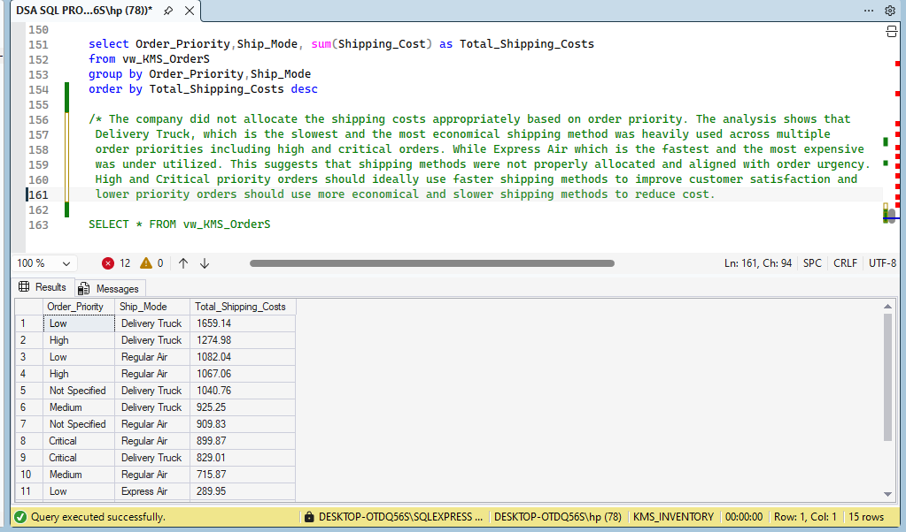

# Kultra-Mega-Sales-Inventory
Data analysis project using SQL to analyze sales performance, customer trends and operational efficiency.
## Tools Used
- SQL Server
- SQL Queries
- Data Analysis
## Business Questions Answered
- Which product category had the highest sales?
- What are the Top 3 and Bottom 3 regions in terms of sales?
- Which shipping method incurred the most shipping cost?
- Who are the most valuable customers with the highest purchases
- What products or services were purchased the most?
## SQL Concepts Used
- SELECT
- WHERE
- BETWEEN
- TOP
- GROUP BY
- JOINS
- VIEW
- ORDER BY
- Aggregate Functions
## Key Insights
- Technology is the Product Category that had the highest Sales.
- The Ontario region generated the highest total sales
- Some regions show consistently low sales performance
- Delivery Truck is the shipping method with the most shipping cost
- The customers with the highest purchases purchased Furniture,Technology and Office supplies the most.
## KMS Analysis Screenshot

  
